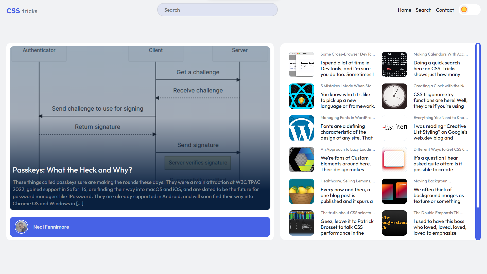

# My SPA Website - Built with Vanilla JavaScript and WordPress API

`Understanding modern tools from their origin. 🙂`

## Descripción

This Single Page Application (SPA) is a website developed entirely with pure JavaScript, without using any JavaScript frameworks. It interacts with the WordPress API to retrieve content from the "css-tricks" website. The SPA consists of three main sections accessible from the header: "Home," "Search," and "Contact."

### Features

- Home Section: The landing page of the SPA, presenting a concise overview of the site's purpose and navigation options to explore further.

- Search Section: Allows users to search for articles and view a list of recent and featured posts from the "css-tricks" website.

- Contact Section: Provides users with contact information and a form to submit inquiries or messages.

- Article Preview: Clicking on an article in the "Search" section opens a preview with ordered content (styled with a reset and general styles) taken from the WordPress API. If the article content is unavailable, users can click a link to view the original article or be automatically redirected.

- React/Svelte-like Component Structure: The SPA follows a component-based structure similar to "React" or "Svelte." Components are created as functions and exported. They generate nodes to be rendered and their content using template strings. Component-specific events are added to the "document" for user interaction.

- Utility Functions: Separated utility functions handle API requests to fetch content for each component, manage routes, and toggle between light and dark themes.

### Technologies

Desarrollo

- JavaScript
- Css 3
- Html 5

Diseño

- Anything

Otros

- Markdown

### Author

Created by
**_@Nicolas-dev_**
